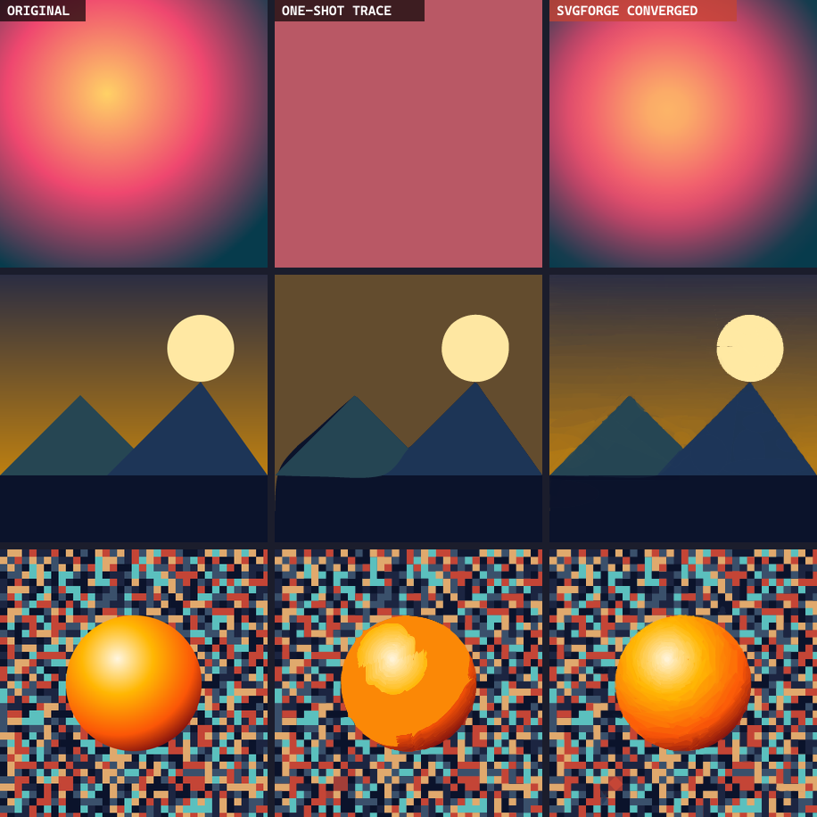

# agentic-svg

Raster to SVG converter that refines its output in a loop instead of tracing once and stopping.

Normal vectorizers (VTracer, Potrace, Illustrator's Image Trace) do a single pass. They're great on flat logos and useless on anything with a gradient, soft shading, or a photo — the output either flattens smooth areas into solid blobs or shatters them into thousands of shapes. agentic-svg traces a base, renders it back to pixels, measures where it's wrong, and spends extra shapes only on those spots. Repeat until it stops improving.

It's the same idea as the research vectorizers (LIVE, DiffVG) but without the differentiable CUDA renderer — greedy hill-climbing does the refinement, so it's plain Node and runs on any machine.



Left to right: original, one-shot trace, agentic-svg. The middle column is what a normal vectorizer produces; the gradient collapses to a flat fill and the shaded sphere loses its shading.

## Results

Measured by rendering the output SVG back to pixels and comparing to the source (DSSIM, lower is closer):

| image | one-shot trace | agentic-svg | notes |
| --- | --- | --- | --- |
| flat logo | 0.0036 | 0.0025 | clean trace plus a few corrections, 5 KB |
| gradient scene | 0.0357 | 0.0040 | gradient sky recovered |
| radial gradient | 0.066 | 0.0057 | fitted as a real `<radialGradient>`, 0.8 KB |
| photo subject | 0.019 | 0.0068 | shading recovered |
| UI screenshot | unreadable | 0.016 | text stays legible (see below) |

## How it works

```
input
  -> classify (flat / illustration / photo / text)
  -> base: VTracer trace OR a fitted SVG gradient, whichever has lower error
  -> render base to pixels (resvg), build an error map
  -> loop: pick the highest-error region, search a primitive there,
           keep it only if it lowers the error  (shapes capped to the region)
  -> stop on plateau or quality target
  -> if refinement made it perceptually worse than the base, drop it
  -> svgo cleanup
```

A few things worth calling out:

- **Base is whichever is better.** For smooth images a single fitted gradient beats a trace (no banding, a few hundred bytes), so it's used as the seed; otherwise the trace is.
- **Text and screenshots** are traced at ~2x the source resolution. VTracer's curve fitting needs enough pixels per glyph; at native size small text turns to mush, at 2x it stays readable.
- **Shape size is capped** to the local region during refinement. Without that, a shape seeded in a small area can grow to cover the whole image and leave a big translucent smear.
- **Importance weighting** (optional, on for non-flat images) biases refinement toward distinct/central subjects so the foreground stays sharp while a busy background is left approximate.
- **Safety guard:** the refinement objective is RMSE, but on already-clean bases shaving RMSE can add structure that hurts perceptual quality. If the final result scores worse than the base, the refinement layer is thrown away.

## Running it

**Easiest (Windows):** double-click **`agentic-svg.cmd`**. It installs
dependencies the first time, starts the local app, and opens it in your browser.
Keep the window open while you use it; close it to stop. (`make-shortcut.cmd`
drops a desktop shortcut with an icon if you want one.)

Otherwise:

```bash
npm install

# web app: drop an image, watch it converge, download the SVG
npm run server          # http://localhost:5173

# CLI
node src/cli.js input.png out.svg --quality high   # draft | balanced | high | max

# tests
npm test
```

## Layout

| path | what |
| --- | --- |
| `src/core/image.js` | decode / resize / fill RGBA buffers |
| `src/core/raster.js` | scanline fill, optimal color, RMSE, compositing |
| `src/core/shapes.js` | triangle / ellipse / rotated rect, region-seeded sampling |
| `src/core/metrics.js` | RMSE, DSSIM, per-block error map |
| `src/core/render.js` | SVG to RGBA via resvg |
| `src/core/trace.js` | VTracer presets |
| `src/core/gradient.js` | fit and emit linear/radial gradients |
| `src/core/saliency.js` | importance map (region distinctiveness + center bias) |
| `src/core/optimizer.js` | the model: seed, hill-climb, error-targeted refinement |
| `src/core/converge.js` | the loop |
| `src/core/classify.js` | router + quality presets |
| `src/core/pipeline.js` | `convertImage()` plus svgo cleanup |
| `src/server/server.js` | static host + streaming convert API |
| `web/` | front end |

## Limits

- Photos with a lot of high-frequency noise produce large SVGs — vectorizing noise is inherently expensive.
- Very small text below roughly 9px in the source can still smear; there's a limit to what curve fitting can recover.
- The server runs one conversion at a time. A worker pool is the obvious next step (the module is in `src/core/pool.js`).

## License

MIT
